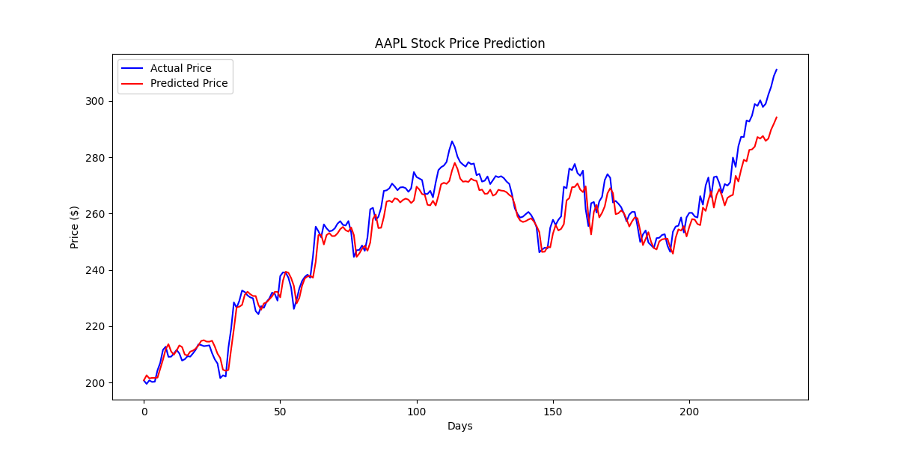

# Stock Price Predictor

A stock price predictor built with PyTorch using an LSTM neural network, trained on historical data from Yahoo Finance.

## Preview

## How it works

Downloads 5 years of daily closing price data for a stock, trains an LSTM model on 80% of it, and predicts prices on the remaining 20%.

